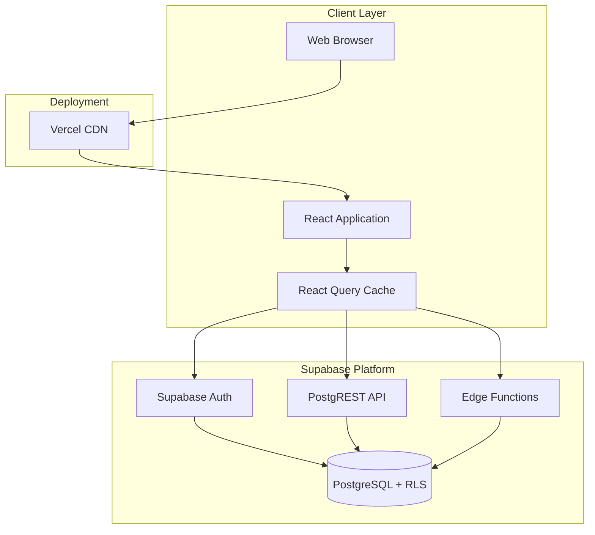
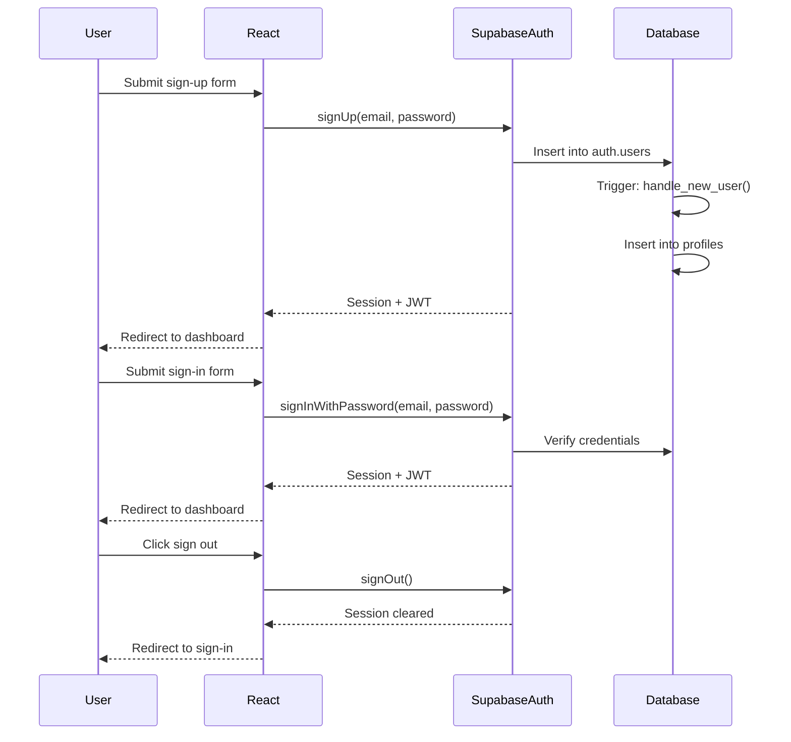
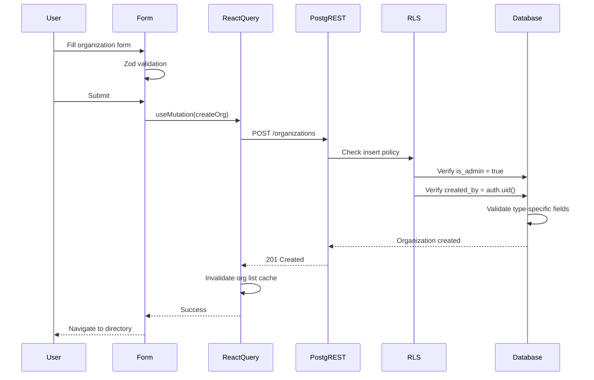
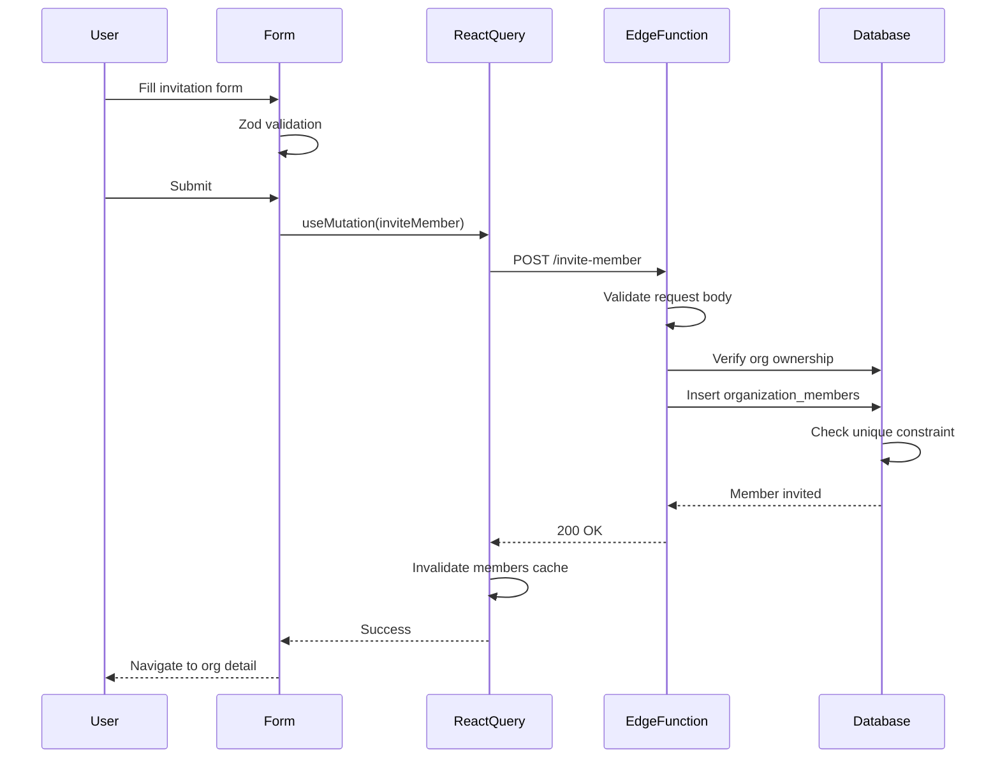
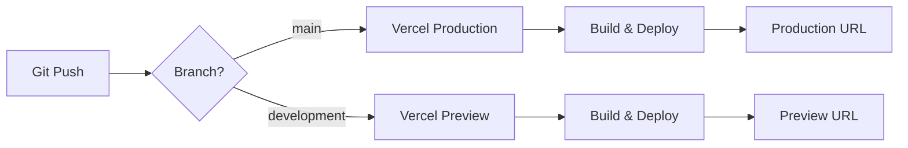

# Design Document: Admin Dashboard

## Overview

The Admin Dashboard is a full-stack web application built with React, TypeScript, Vite, and Supabase. It provides a secure, role-based platform for administrators to create and manage organizations with type-specific attributes (School, Nonprofit, Business) and invite members via email. The system enforces strict data isolation through Row Level Security (RLS) policies, ensuring admins can only access organizations they created.

### Key Features

- **Secure Authentication**: Email/password authentication with Supabase Auth
- **Organization Management**: Create organizations with type-specific validation
- **Member Invitations**: Invite members via email with role assignment (member/manager)
- **Directory View**: Browse organizations with member counts and metadata
- **Role-Based Access Control**: RLS policies enforce data isolation per admin
- **Type Safety**: Comprehensive TypeScript types generated from database schema
- **Form Validation**: Client-side validation using Zod schemas and React Hook Form
- **Optimistic Updates**: React Query for caching and automatic refetching

### Technology Stack

- **Frontend**: React 18, TypeScript, Vite, TailwindCSS, shadcn/ui
- **Backend**: Supabase (PostgreSQL, Auth, Edge Functions)
- **State Management**: React Query (TanStack Query)
- **Form Handling**: React Hook Form + Zod
- **Routing**: React Router v6
- **Deployment**: Vercel (production + preview environments)

## Architecture

### High-Level Architecture



### Architecture Layers

#### 1. Presentation Layer (React Frontend)

- **Responsibility**: User interface, form validation, routing, state management
- **Components**: Pages, UI components (shadcn/ui), forms, protected routes
- **State**: React Query manages server state; React Hook Form manages form state
- **Routing**: React Router with protected route wrappers

#### 2. API Layer (Supabase)

- **PostgREST**: Auto-generated REST API from PostgreSQL schema
- **Edge Functions**: Custom Deno functions for complex operations (e.g., member invitations)
- **Supabase Auth**: JWT-based authentication with session management
- **Real-time**: WebSocket subscriptions (not used in current scope)

#### 3. Data Layer (PostgreSQL + RLS)

- **Database**: PostgreSQL with custom types, constraints, and triggers
- **Row Level Security**: Policies enforce data isolation at the database level
- **Triggers**: Automatic profile creation on user signup
- **Views**: Materialized queries for performance (e.g., organization_directory)

#### 4. Deployment Layer (Vercel)

- **Production**: Main branch deploys to production environment
- **Preview**: Development branch deploys to preview environment
- **Environment Variables**: Supabase URL and anon key configured per environment


### Authentication Flow



### Data Flow: Organization Creation




### Data Flow: Member Invitation



## Components and Interfaces

### Frontend Component Structure

```
src/
├── main.tsx                    # Application entry point
├── router.tsx                  # Route definitions
├── styles.css                  # Global styles (Tailwind)
│
├── components/
│   ├── app-layout.tsx          # Main layout with header/nav
│   ├── protected-route.tsx     # Auth guard wrapper
│   ├── missing-supabase-config.tsx  # Error boundary for config
│   └── ui/                     # shadcn/ui components
│       ├── button.tsx
│       ├── card.tsx
│       ├── form-field.tsx
│       ├── input.tsx
│       ├── label.tsx
│       ├── select.tsx
│       └── badge.tsx
│
├── pages/
│   ├── auth-page.tsx           # Sign-in/sign-up forms
│   ├── organizations-page.tsx  # Directory view
│   ├── create-organization-page.tsx  # Organization form
│   └── organization-detail-page.tsx  # Detail + members
│
├── hooks/
│   └── use-auth.ts             # Authentication hook
│
├── api/
│   ├── organizations.ts        # Organization queries/mutations
│   └── profile.ts              # Profile queries
│
├── schemas/
│   ├── auth.ts                 # Zod schema for auth forms
│   ├── organization.ts         # Zod schema for org forms
│   └── invitation.ts           # Zod schema for invitation forms
│
├── types/
│   └── database.ts             # TypeScript types from Supabase
│
├── lib/
│   ├── supabase.ts             # Supabase client initialization
│   └── utils.ts                # Utility functions (cn, etc.)
│
└── constants/
    └── organizations.ts        # Organization type constants
```


### Key Component Interfaces

#### AppLayout Component

```typescript
interface AppLayoutProps {
  children: React.ReactNode;
}

// Renders:
// - Header with user email and sign-out button
// - Navigation links
// - Main content area
```

#### ProtectedRoute Component

```typescript
interface ProtectedRouteProps {
  children: React.ReactNode;
}

// Behavior:
// - Checks authentication status via useAuth()
// - Redirects to /auth if not authenticated
// - Renders children if authenticated
```

#### OrganizationsPage Component

```typescript
// Fetches organization_directory view
// Displays:
// - List of organizations with name, type badge, member count, date
// - Empty state if no organizations
// - Loading state during fetch
// - Error state on failure
// - "Create Organization" button
```

#### CreateOrganizationPage Component

```typescript
interface OrganizationFormData {
  name: string;
  type: 'school' | 'nonprofit' | 'business';
  school_district?: string;
  tax_id?: string;
  business_domain?: string;
}

// Features:
// - Dynamic form fields based on selected type
// - Zod validation with React Hook Form
// - Mutation with React Query
// - Navigation on success
```

#### OrganizationDetailPage Component

```typescript
// Fetches:
// - Organization by ID
// - Members for organization
// Displays:
// - Organization metadata
// - Type-specific field
// - Members list with status badges
// - "Invite Member" button
```

#### InviteMemberForm Component

```typescript
interface InvitationFormData {
  email: string;
  role: 'member' | 'manager';
}

// Features:
// - Email validation (RFC 5322)
// - Role selection dropdown
// - Edge Function mutation
// - Error handling for duplicates
```


### Routing Structure

```typescript
// Route definitions
const routes = [
  {
    path: '/auth',
    element: <AuthPage />,
    public: true
  },
  {
    path: '/',
    element: <ProtectedRoute><AppLayout><OrganizationsPage /></AppLayout></ProtectedRoute>
  },
  {
    path: '/organizations/new',
    element: <ProtectedRoute><AppLayout><CreateOrganizationPage /></AppLayout></ProtectedRoute>
  },
  {
    path: '/organizations/:id',
    element: <ProtectedRoute><AppLayout><OrganizationDetailPage /></AppLayout></ProtectedRoute>
  }
];
```

## Data Models

### Database Schema

#### Enums

```sql
-- Organization types
CREATE TYPE organization_type AS ENUM ('school', 'nonprofit', 'business');

-- Member invitation/activation status
CREATE TYPE member_status AS ENUM ('invited', 'active');

-- Member permission level
CREATE TYPE member_role AS ENUM ('member', 'manager');
```

#### Tables

##### profiles

```sql
CREATE TABLE profiles (
  id UUID PRIMARY KEY REFERENCES auth.users(id) ON DELETE CASCADE,
  email TEXT NOT NULL,
  full_name TEXT,
  is_admin BOOLEAN NOT NULL DEFAULT false,
  created_at TIMESTAMPTZ NOT NULL DEFAULT now()
);
```

**Purpose**: Stores user profile information and admin status

**Relationships**:
- `id` → `auth.users.id` (one-to-one, cascade delete)

**Constraints**:
- Primary key on `id`
- `is_admin` defaults to `false`

**RLS Policies**:
- SELECT: Users can read only their own profile
- UPDATE: Users can update only their own profile


##### organizations

```sql
CREATE TABLE organizations (
  id UUID PRIMARY KEY DEFAULT gen_random_uuid(),
  name TEXT NOT NULL CHECK (char_length(trim(name)) >= 2),
  type organization_type NOT NULL,
  created_by UUID NOT NULL DEFAULT auth.uid() REFERENCES auth.users(id) ON DELETE CASCADE,
  created_at TIMESTAMPTZ NOT NULL DEFAULT now(),
  school_district TEXT,
  tax_id TEXT,
  business_domain TEXT,
  CONSTRAINT organizations_type_fields_check CHECK (
    (type = 'school' AND school_district IS NOT NULL AND tax_id IS NULL AND business_domain IS NULL)
    OR (type = 'nonprofit' AND tax_id IS NOT NULL AND school_district IS NULL AND business_domain IS NULL)
    OR (type = 'business' AND business_domain IS NOT NULL AND school_district IS NULL AND tax_id IS NULL)
  )
);

CREATE INDEX organizations_created_by_idx ON organizations(created_by);
```

**Purpose**: Stores organization metadata with type-specific attributes

**Relationships**:
- `created_by` → `auth.users.id` (many-to-one, cascade delete)

**Constraints**:
- `name` must be at least 2 characters after trimming
- Type-specific fields enforced via check constraint:
  - School: `school_district` required, others null
  - Nonprofit: `tax_id` required, others null
  - Business: `business_domain` required, others null

**Indexes**:
- `created_by` for filtering organizations by admin

**RLS Policies**:
- INSERT: Only admins (`is_admin = true`) can create, must set `created_by = auth.uid()`
- SELECT: Admins can read only organizations where `created_by = auth.uid()`
- UPDATE: Admins can update only organizations where `created_by = auth.uid()`
- DELETE: Admins can delete only organizations where `created_by = auth.uid()`


##### organization_members

```sql
CREATE TABLE organization_members (
  id UUID PRIMARY KEY DEFAULT gen_random_uuid(),
  organization_id UUID NOT NULL REFERENCES organizations(id) ON DELETE CASCADE,
  user_id UUID REFERENCES auth.users(id) ON DELETE SET NULL,
  email TEXT NOT NULL,
  status member_status NOT NULL DEFAULT 'invited',
  role member_role NOT NULL DEFAULT 'member',
  invited_at TIMESTAMPTZ NOT NULL DEFAULT now(),
  joined_at TIMESTAMPTZ,
  CONSTRAINT organization_members_email_check CHECK (
    email = lower(email) AND email ~* '^[A-Z0-9._%+-]+@[A-Z0-9.-]+\.[A-Z]{2,}$'
  ),
  CONSTRAINT organization_members_unique_email UNIQUE (organization_id, email)
);

CREATE INDEX organization_members_organization_id_idx ON organization_members(organization_id);
```

**Purpose**: Stores member invitations and memberships

**Relationships**:
- `organization_id` → `organizations.id` (many-to-one, cascade delete)
- `user_id` → `auth.users.id` (many-to-one, set null on delete)

**Constraints**:
- `email` must be lowercase and match RFC 5322 format
- Unique constraint on `(organization_id, email)` prevents duplicate invitations
- `status` defaults to `'invited'`
- `role` defaults to `'member'`

**Indexes**:
- `organization_id` for fetching members by organization

**RLS Policies**:
- SELECT: Admins can read members only for organizations they created
- INSERT: Admins can insert members only for organizations they created
- UPDATE: Admins can update members only for organizations they created

#### Views

##### organization_directory

```sql
CREATE VIEW organization_directory AS
SELECT
  organizations.*,
  COUNT(organization_members.id)::INT AS member_count
FROM organizations
LEFT JOIN organization_members ON organization_members.organization_id = organizations.id
GROUP BY organizations.id;
```

**Purpose**: Provides organization list with member counts for efficient directory queries

**Security**: Uses `security_invoker = true` to inherit RLS policies from base tables


#### Triggers

##### handle_new_user

```sql
CREATE FUNCTION handle_new_user()
RETURNS TRIGGER
LANGUAGE plpgsql
SECURITY DEFINER
SET search_path = public
AS $$
BEGIN
  INSERT INTO profiles (id, email, full_name, is_admin)
  VALUES (
    NEW.id,
    COALESCE(NEW.email, ''),
    NEW.raw_user_meta_data ->> 'full_name',
    false
  );
  RETURN NEW;
END;
$$;

CREATE TRIGGER on_auth_user_created
  AFTER INSERT ON auth.users
  FOR EACH ROW EXECUTE PROCEDURE handle_new_user();
```

**Purpose**: Automatically creates a profile record when a user signs up

**Behavior**:
- Extracts `full_name` from user metadata
- Sets `is_admin` to `false` by default
- Runs with `SECURITY DEFINER` to bypass RLS during profile creation

### TypeScript Type Definitions

```typescript
// Enum types
export type OrganizationType = 'school' | 'nonprofit' | 'business';
export type MemberStatus = 'invited' | 'active';
export type MemberRole = 'member' | 'manager';

// Database interface
export interface Database {
  public: {
    Tables: {
      profiles: {
        Row: {
          id: string;
          email: string;
          full_name: string | null;
          is_admin: boolean;
          created_at: string;
        };
        Insert: {
          id: string;
          email: string;
          full_name?: string | null;
          is_admin?: boolean;
          created_at?: string;
        };
        Update: Partial<Database['public']['Tables']['profiles']['Insert']>;
      };
      organizations: {
        Row: {
          id: string;
          name: string;
          type: OrganizationType;
          created_by: string;
          created_at: string;
          school_district: string | null;
          tax_id: string | null;
          business_domain: string | null;
        };
        Insert: {
          id?: string;
          name: string;
          type: OrganizationType;
          created_by?: string;
          created_at?: string;
          school_district?: string | null;
          tax_id?: string | null;
          business_domain?: string | null;
        };
        Update: Partial<Database['public']['Tables']['organizations']['Insert']>;
      };
      organization_members: {
        Row: {
          id: string;
          organization_id: string;
          user_id: string | null;
          email: string;
          status: MemberStatus;
          role: MemberRole;
          invited_at: string;
          joined_at: string | null;
        };
        Insert: {
          id?: string;
          organization_id: string;
          user_id?: string | null;
          email: string;
          status?: MemberStatus;
          role?: MemberRole;
          invited_at?: string;
          joined_at?: string | null;
        };
        Update: Partial<Database['public']['Tables']['organization_members']['Insert']>;
      };
    };
  };
}
```


## API Design

### Supabase PostgREST Endpoints

The PostgREST API is auto-generated from the database schema. All requests include the JWT token in the `Authorization` header.

#### Authentication

```typescript
// Sign up
POST /auth/v1/signup
Body: { email: string, password: string }
Response: { user: User, session: Session }

// Sign in
POST /auth/v1/token?grant_type=password
Body: { email: string, password: string }
Response: { access_token: string, refresh_token: string, user: User }

// Sign out
POST /auth/v1/logout
Headers: { Authorization: Bearer <token> }
Response: 204 No Content
```

#### Profiles

```typescript
// Get current user profile
GET /rest/v1/profiles?id=eq.<user_id>
Headers: { Authorization: Bearer <token> }
Response: Profile[]

// Update profile
PATCH /rest/v1/profiles?id=eq.<user_id>
Headers: { Authorization: Bearer <token> }
Body: { full_name?: string }
Response: Profile[]
```

#### Organizations

```typescript
// List organizations (directory view)
GET /rest/v1/organization_directory?created_by=eq.<user_id>&order=created_at.desc
Headers: { Authorization: Bearer <token> }
Response: OrganizationDirectory[]

// Get single organization
GET /rest/v1/organizations?id=eq.<org_id>
Headers: { Authorization: Bearer <token> }
Response: Organization[]

// Create organization
POST /rest/v1/organizations
Headers: { Authorization: Bearer <token> }
Body: {
  name: string,
  type: OrganizationType,
  school_district?: string,
  tax_id?: string,
  business_domain?: string
}
Response: Organization

// Update organization
PATCH /rest/v1/organizations?id=eq.<org_id>
Headers: { Authorization: Bearer <token> }
Body: Partial<Organization>
Response: Organization[]

// Delete organization
DELETE /rest/v1/organizations?id=eq.<org_id>
Headers: { Authorization: Bearer <token> }
Response: 204 No Content
```


#### Organization Members

```typescript
// List members for organization
GET /rest/v1/organization_members?organization_id=eq.<org_id>&order=invited_at.desc
Headers: { Authorization: Bearer <token> }
Response: OrganizationMember[]

// Update member
PATCH /rest/v1/organization_members?id=eq.<member_id>
Headers: { Authorization: Bearer <token> }
Body: { status?: MemberStatus, role?: MemberRole }
Response: OrganizationMember[]
```

### Supabase Edge Functions

#### invite-member

```typescript
POST /functions/v1/invite-member
Headers: { Authorization: Bearer <token> }
Body: {
  organization_id: string,
  email: string,
  role: 'member' | 'manager'
}

Response (Success):
{
  success: true,
  member: OrganizationMember
}

Response (Error - Not Authorized):
{
  error: 'Not authorized to invite members to this organization'
}
Status: 403

Response (Error - Duplicate):
{
  error: 'Member with this email already invited'
}
Status: 409

Response (Error - Validation):
{
  error: 'Invalid request body'
}
Status: 400
```

**Implementation**:

```typescript
// supabase/functions/invite-member/index.ts
import { createClient } from '@supabase/supabase-js';
import { z } from 'zod';

const invitationSchema = z.object({
  organization_id: z.string().uuid(),
  email: z.string().email().toLowerCase(),
  role: z.enum(['member', 'manager'])
});

Deno.serve(async (req) => {
  const supabaseClient = createClient(
    Deno.env.get('SUPABASE_URL')!,
    Deno.env.get('SUPABASE_SERVICE_ROLE_KEY')!
  );

  // Get authenticated user
  const authHeader = req.headers.get('Authorization')!;
  const token = authHeader.replace('Bearer ', '');
  const { data: { user } } = await supabaseClient.auth.getUser(token);

  if (!user) {
    return new Response(JSON.stringify({ error: 'Unauthorized' }), {
      status: 401,
      headers: { 'Content-Type': 'application/json' }
    });
  }

  // Parse and validate request body
  const body = await req.json();
  const validation = invitationSchema.safeParse(body);

  if (!validation.success) {
    return new Response(JSON.stringify({ error: 'Invalid request body' }), {
      status: 400,
      headers: { 'Content-Type': 'application/json' }
    });
  }

  const { organization_id, email, role } = validation.data;

  // Verify user owns the organization
  const { data: org } = await supabaseClient
    .from('organizations')
    .select('id')
    .eq('id', organization_id)
    .eq('created_by', user.id)
    .single();

  if (!org) {
    return new Response(
      JSON.stringify({ error: 'Not authorized to invite members to this organization' }),
      { status: 403, headers: { 'Content-Type': 'application/json' } }
    );
  }

  // Insert member invitation
  const { data: member, error } = await supabaseClient
    .from('organization_members')
    .insert({ organization_id, email, role, status: 'invited' })
    .select()
    .single();

  if (error) {
    if (error.code === '23505') { // Unique constraint violation
      return new Response(
        JSON.stringify({ error: 'Member with this email already invited' }),
        { status: 409, headers: { 'Content-Type': 'application/json' } }
      );
    }
    throw error;
  }

  return new Response(JSON.stringify({ success: true, member }), {
    status: 200,
    headers: { 'Content-Type': 'application/json' }
  });
});
```


## State Management

### React Query Configuration

```typescript
// main.tsx
import { QueryClient, QueryClientProvider } from '@tanstack/react-query';

const queryClient = new QueryClient({
  defaultOptions: {
    queries: {
      staleTime: 1000 * 60 * 5, // 5 minutes
      retry: 1,
      refetchOnWindowFocus: false
    },
    mutations: {
      retry: 0
    }
  }
});

function App() {
  return (
    <QueryClientProvider client={queryClient}>
      <RouterProvider router={router} />
    </QueryClientProvider>
  );
}
```

### Query Keys

```typescript
// Consistent query key structure
const queryKeys = {
  profile: ['profile'] as const,
  organizations: ['organizations'] as const,
  organization: (id: string) => ['organizations', id] as const,
  members: (orgId: string) => ['organizations', orgId, 'members'] as const
};
```

### Custom Hooks

#### useAuth

```typescript
// hooks/use-auth.ts
export function useAuth() {
  const [user, setUser] = useState<User | null>(null);
  const [loading, setLoading] = useState(true);

  useEffect(() => {
    // Get initial session
    supabase.auth.getSession().then(({ data: { session } }) => {
      setUser(session?.user ?? null);
      setLoading(false);
    });

    // Listen for auth changes
    const { data: { subscription } } = supabase.auth.onAuthStateChange(
      (_event, session) => {
        setUser(session?.user ?? null);
      }
    );

    return () => subscription.unsubscribe();
  }, []);

  return { user, loading };
}
```

#### useOrganizations

```typescript
// api/organizations.ts
export function useOrganizations() {
  return useQuery({
    queryKey: queryKeys.organizations,
    queryFn: async () => {
      const { data, error } = await supabase
        .from('organization_directory')
        .select('*')
        .order('created_at', { ascending: false });

      if (error) throw error;
      return data;
    }
  });
}
```


#### useCreateOrganization

```typescript
export function useCreateOrganization() {
  const queryClient = useQueryClient();

  return useMutation({
    mutationFn: async (data: OrganizationFormData) => {
      const { data: org, error } = await supabase
        .from('organizations')
        .insert(data)
        .select()
        .single();

      if (error) throw error;
      return org;
    },
    onSuccess: () => {
      // Invalidate organizations list to trigger refetch
      queryClient.invalidateQueries({ queryKey: queryKeys.organizations });
    }
  });
}
```

#### useInviteMember

```typescript
export function useInviteMember() {
  const queryClient = useQueryClient();

  return useMutation({
    mutationFn: async (data: InvitationFormData & { organization_id: string }) => {
      const { data: result, error } = await supabase.functions.invoke('invite-member', {
        body: data
      });

      if (error) throw error;
      return result;
    },
    onSuccess: (_data, variables) => {
      // Invalidate members list for this organization
      queryClient.invalidateQueries({
        queryKey: queryKeys.members(variables.organization_id)
      });
    }
  });
}
```

## Form Validation

### Zod Schemas

#### Authentication Schema

```typescript
// schemas/auth.ts
import { z } from 'zod';

export const authSchema = z.object({
  email: z.string().email('Invalid email address'),
  password: z.string().min(8, 'Password must be at least 8 characters')
});

export type AuthFormData = z.infer<typeof authSchema>;
```

#### Organization Schema

```typescript
// schemas/organization.ts
import { z } from 'zod';

const baseSchema = z.object({
  name: z.string().min(2, 'Name must be at least 2 characters').trim(),
  type: z.enum(['school', 'nonprofit', 'business'])
});

export const organizationSchema = z.discriminatedUnion('type', [
  baseSchema.extend({
    type: z.literal('school'),
    school_district: z.string().min(1, 'School district is required')
  }),
  baseSchema.extend({
    type: z.literal('nonprofit'),
    tax_id: z.string().min(1, 'Tax ID is required')
  }),
  baseSchema.extend({
    type: z.literal('business'),
    business_domain: z.string().min(1, 'Business domain is required')
  })
]);

export type OrganizationFormData = z.infer<typeof organizationSchema>;
```


#### Invitation Schema

```typescript
// schemas/invitation.ts
import { z } from 'zod';

export const invitationSchema = z.object({
  email: z
    .string()
    .email('Invalid email address')
    .transform(val => val.toLowerCase()),
  role: z.enum(['member', 'manager'])
});

export type InvitationFormData = z.infer<typeof invitationSchema>;
```

### React Hook Form Integration

```typescript
// Example: CreateOrganizationPage
import { useForm } from 'react-hook-form';
import { zodResolver } from '@hookform/resolvers/zod';

function CreateOrganizationPage() {
  const form = useForm<OrganizationFormData>({
    resolver: zodResolver(organizationSchema),
    defaultValues: {
      name: '',
      type: 'school'
    }
  });

  const createMutation = useCreateOrganization();

  const onSubmit = (data: OrganizationFormData) => {
    createMutation.mutate(data, {
      onSuccess: () => {
        navigate('/');
      }
    });
  };

  return (
    <form onSubmit={form.handleSubmit(onSubmit)}>
      <FormField
        control={form.control}
        name="name"
        render={({ field }) => (
          <div>
            <Label>Organization Name</Label>
            <Input {...field} />
            {form.formState.errors.name && (
              <p className="text-red-500">{form.formState.errors.name.message}</p>
            )}
          </div>
        )}
      />
      {/* Additional fields... */}
      <Button type="submit" disabled={createMutation.isPending}>
        {createMutation.isPending ? 'Creating...' : 'Create Organization'}
      </Button>
    </form>
  );
}
```

## Error Handling

### Error Types

```typescript
// Common error scenarios
type AppError =
  | { type: 'auth'; message: string }
  | { type: 'validation'; field: string; message: string }
  | { type: 'network'; message: string }
  | { type: 'permission'; message: string }
  | { type: 'conflict'; message: string }
  | { type: 'not_found'; message: string };
```

### Error Handling Strategy

1. **Authentication Errors**: Redirect to sign-in page, clear session
2. **Validation Errors**: Display inline field errors via React Hook Form
3. **Network Errors**: Display toast notification with retry option
4. **Permission Errors (403)**: Display message explaining access restriction
5. **Conflict Errors (409)**: Display specific message (e.g., "Email already invited")
6. **Not Found Errors (404)**: Display empty state or redirect to directory


### Error Handling in Components

```typescript
// Example: Error boundary for queries
function OrganizationsPage() {
  const { data, isLoading, error } = useOrganizations();

  if (isLoading) {
    return <div>Loading organizations...</div>;
  }

  if (error) {
    return (
      <div className="error-state">
        <p>Failed to load organizations: {error.message}</p>
        <Button onClick={() => queryClient.invalidateQueries({ queryKey: queryKeys.organizations })}>
          Retry
        </Button>
      </div>
    );
  }

  if (!data || data.length === 0) {
    return (
      <div className="empty-state">
        <p>No organizations yet</p>
        <Button onClick={() => navigate('/organizations/new')}>
          Create Your First Organization
        </Button>
      </div>
    );
  }

  return <OrganizationList organizations={data} />;
}
```

### Mutation Error Handling

```typescript
// Example: Handling Edge Function errors
function InviteMemberForm({ organizationId }: { organizationId: string }) {
  const inviteMutation = useInviteMember();

  const onSubmit = (data: InvitationFormData) => {
    inviteMutation.mutate(
      { ...data, organization_id: organizationId },
      {
        onSuccess: () => {
          navigate(`/organizations/${organizationId}`);
        },
        onError: (error: any) => {
          if (error.message.includes('already invited')) {
            form.setError('email', {
              type: 'manual',
              message: 'This email has already been invited'
            });
          } else if (error.message.includes('Not authorized')) {
            alert('You do not have permission to invite members to this organization');
          } else {
            alert('Failed to send invitation. Please try again.');
          }
        }
      }
    );
  };

  return (
    <form onSubmit={form.handleSubmit(onSubmit)}>
      {/* Form fields */}
      {inviteMutation.error && (
        <div className="error-message">
          {inviteMutation.error.message}
        </div>
      )}
    </form>
  );
}
```

## Security Considerations

### Row Level Security (RLS)

**Design Principle**: All data access is controlled at the database level, not the application level. This ensures security even if the frontend is compromised.

#### Profile Security

- Users can only read and update their own profile
- Profile creation is handled by database trigger (bypasses RLS with SECURITY DEFINER)
- `is_admin` flag cannot be modified by users (requires database admin)

#### Organization Security

- Only users with `is_admin = true` can create organizations
- Admins can only read/update/delete organizations where `created_by = auth.uid()`
- This ensures complete data isolation between admins


#### Member Security

- Admins can only read/insert/update members for organizations they created
- The RLS policy checks organization ownership via subquery
- Prevents cross-organization member access

### Authentication Security

#### JWT Token Management

- Tokens stored in Supabase client (localStorage with httpOnly fallback)
- Automatic token refresh handled by Supabase client
- Tokens include user ID and role claims
- Short-lived access tokens (1 hour) with refresh tokens

#### Password Security

- Minimum 8 characters enforced at client and server
- Passwords hashed with bcrypt by Supabase Auth
- No password storage in application code
- Password reset via Supabase Auth email flow

### Environment Variables

```bash
# .env.local (not committed)
VITE_SUPABASE_URL=https://xxxxx.supabase.co
VITE_SUPABASE_ANON_KEY=eyJhbGciOiJIUzI1NiIsInR5cCI6IkpXVCJ9...

# .env.example (committed)
VITE_SUPABASE_URL=your_supabase_url
VITE_SUPABASE_ANON_KEY=your_supabase_anon_key
```

**Security Notes**:
- Anon key is safe to expose (RLS enforces access control)
- Service role key NEVER exposed to frontend
- Service role key only used in Edge Functions (server-side)
- Environment variables validated at startup

### Input Validation

**Defense in Depth**: Validation at multiple layers

1. **Client-side (Zod)**: Immediate feedback, prevents unnecessary API calls
2. **Database constraints**: Final enforcement, prevents invalid data
3. **Edge Function validation**: Server-side validation for custom endpoints

### SQL Injection Prevention

- All queries use parameterized statements via Supabase client
- PostgREST automatically sanitizes inputs
- No raw SQL construction in application code

### XSS Prevention

- React automatically escapes rendered content
- No use of `dangerouslySetInnerHTML`
- Content Security Policy headers configured in Vercel

### CSRF Prevention

- JWT tokens in Authorization header (not cookies)
- SameSite cookie policy for session cookies
- Supabase handles CSRF protection for auth endpoints


## Deployment Architecture

### Vercel Configuration

```json
// vercel.json
{
  "buildCommand": "npm run build",
  "outputDirectory": "dist",
  "framework": "vite",
  "rewrites": [
    { "source": "/(.*)", "destination": "/index.html" }
  ]
}
```

### Environment Setup

#### Production Environment

- **Branch**: `main`
- **URL**: `https://admin-dashboard.vercel.app`
- **Environment Variables**:
  - `VITE_SUPABASE_URL`: Production Supabase project URL
  - `VITE_SUPABASE_ANON_KEY`: Production anon key
- **Database**: Production Supabase instance with RLS enabled

#### Preview Environment

- **Branch**: `development`
- **URL**: `https://admin-dashboard-dev.vercel.app`
- **Environment Variables**:
  - `VITE_SUPABASE_URL`: Development Supabase project URL
  - `VITE_SUPABASE_ANON_KEY`: Development anon key
- **Database**: Development Supabase instance (separate from production)

### Build Process

```bash
# Install dependencies
npm install

# Type check
npm run lint

# Build for production
npm run build

# Output: dist/ directory with optimized assets
```

### Deployment Flow



### Supabase Deployment

#### Database Migrations

```bash
# Apply migrations to development
supabase db push

# Generate TypeScript types
supabase gen types typescript --local > src/types/database.ts

# Apply migrations to production
supabase db push --db-url <production-url>
```

#### Edge Functions Deployment

```bash
# Deploy invite-member function
supabase functions deploy invite-member

# Set environment variables
supabase secrets set SUPABASE_SERVICE_ROLE_KEY=<key>
```


### Performance Optimization

#### Frontend Optimizations

1. **Code Splitting**: React Router lazy loading for routes
2. **Asset Optimization**: Vite automatically optimizes images and bundles
3. **Tree Shaking**: Unused code eliminated during build
4. **Caching**: React Query caches API responses (5-minute stale time)
5. **Lazy Loading**: Components loaded on-demand

#### Database Optimizations

1. **Indexes**: Created on foreign keys and frequently queried columns
2. **Views**: `organization_directory` pre-joins organizations with member counts
3. **Connection Pooling**: Supabase handles connection pooling automatically
4. **Query Optimization**: Use `select()` to fetch only needed columns

#### API Optimizations

1. **Batch Requests**: React Query deduplicates simultaneous requests
2. **Pagination**: Not implemented in v1 (future enhancement)
3. **Caching Headers**: Supabase sets appropriate cache headers
4. **CDN**: Vercel Edge Network caches static assets

## Testing Strategy

### Testing Approach

This application is **NOT suitable for property-based testing** because it consists primarily of:
- CRUD operations with no complex transformation logic
- UI rendering and layout (React components)
- Infrastructure configuration (Supabase, Vercel)
- Side-effect operations (authentication, database writes)

Instead, the testing strategy focuses on:
1. **Unit Tests**: Component logic, form validation, utility functions
2. **Integration Tests**: API interactions, database operations
3. **End-to-End Tests**: User workflows across the full stack

### Unit Testing

#### Component Tests

**Tools**: Vitest + React Testing Library

**Coverage**:
- Form validation logic (Zod schemas)
- Component rendering with different props
- User interaction handlers
- Error state rendering
- Loading state rendering
- Empty state rendering

**Example Test**:

```typescript
// __tests__/components/organization-form.test.tsx
import { render, screen, fireEvent } from '@testing-library/react';
import { CreateOrganizationPage } from '@/pages/create-organization-page';

describe('CreateOrganizationPage', () => {
  it('shows school_district field when school type is selected', () => {
    render(<CreateOrganizationPage />);
    
    const typeSelect = screen.getByLabelText('Organization Type');
    fireEvent.change(typeSelect, { target: { value: 'school' } });
    
    expect(screen.getByLabelText('School District')).toBeInTheDocument();
    expect(screen.queryByLabelText('Tax ID')).not.toBeInTheDocument();
    expect(screen.queryByLabelText('Business Domain')).not.toBeInTheDocument();
  });

  it('validates name minimum length', async () => {
    render(<CreateOrganizationPage />);
    
    const nameInput = screen.getByLabelText('Organization Name');
    fireEvent.change(nameInput, { target: { value: 'A' } });
    fireEvent.blur(nameInput);
    
    expect(await screen.findByText('Name must be at least 2 characters')).toBeInTheDocument();
  });
});
```


#### Schema Validation Tests

```typescript
// __tests__/schemas/organization.test.ts
import { organizationSchema } from '@/schemas/organization';

describe('organizationSchema', () => {
  it('accepts valid school organization', () => {
    const result = organizationSchema.safeParse({
      name: 'Test School',
      type: 'school',
      school_district: 'District 1'
    });
    
    expect(result.success).toBe(true);
  });

  it('rejects school without school_district', () => {
    const result = organizationSchema.safeParse({
      name: 'Test School',
      type: 'school'
    });
    
    expect(result.success).toBe(false);
  });

  it('trims whitespace from name', () => {
    const result = organizationSchema.safeParse({
      name: '  Test School  ',
      type: 'school',
      school_district: 'District 1'
    });
    
    expect(result.success).toBe(true);
    if (result.success) {
      expect(result.data.name).toBe('Test School');
    }
  });
});
```

### Integration Testing

#### Database Tests

**Tools**: Supabase local development + Vitest

**Coverage**:
- RLS policies enforce correct access control
- Foreign key constraints prevent orphaned records
- Check constraints validate data integrity
- Triggers execute correctly (profile creation)
- Unique constraints prevent duplicates

**Example Test**:

```typescript
// __tests__/integration/rls-policies.test.ts
import { createClient } from '@supabase/supabase-js';

describe('RLS Policies', () => {
  let adminClient: SupabaseClient;
  let otherAdminClient: SupabaseClient;

  beforeEach(async () => {
    // Create two admin users
    const admin1 = await createTestUser({ is_admin: true });
    const admin2 = await createTestUser({ is_admin: true });
    
    adminClient = createClient(SUPABASE_URL, SUPABASE_ANON_KEY, {
      global: { headers: { Authorization: `Bearer ${admin1.token}` } }
    });
    
    otherAdminClient = createClient(SUPABASE_URL, SUPABASE_ANON_KEY, {
      global: { headers: { Authorization: `Bearer ${admin2.token}` } }
    });
  });

  it('prevents admin from reading other admin organizations', async () => {
    // Admin 1 creates organization
    const { data: org } = await adminClient
      .from('organizations')
      .insert({ name: 'Test Org', type: 'school', school_district: 'District 1' })
      .select()
      .single();

    // Admin 2 tries to read it
    const { data, error } = await otherAdminClient
      .from('organizations')
      .select()
      .eq('id', org.id);

    expect(data).toEqual([]);
    expect(error).toBeNull();
  });
});
```


#### Edge Function Tests

```typescript
// __tests__/integration/invite-member.test.ts
describe('invite-member Edge Function', () => {
  it('successfully invites member to owned organization', async () => {
    const admin = await createTestUser({ is_admin: true });
    const org = await createTestOrganization(admin.id);

    const response = await fetch(`${SUPABASE_URL}/functions/v1/invite-member`, {
      method: 'POST',
      headers: {
        'Authorization': `Bearer ${admin.token}`,
        'Content-Type': 'application/json'
      },
      body: JSON.stringify({
        organization_id: org.id,
        email: 'member@example.com',
        role: 'member'
      })
    });

    expect(response.status).toBe(200);
    const data = await response.json();
    expect(data.success).toBe(true);
    expect(data.member.email).toBe('member@example.com');
  });

  it('returns 403 when inviting to non-owned organization', async () => {
    const admin1 = await createTestUser({ is_admin: true });
    const admin2 = await createTestUser({ is_admin: true });
    const org = await createTestOrganization(admin1.id);

    const response = await fetch(`${SUPABASE_URL}/functions/v1/invite-member`, {
      method: 'POST',
      headers: {
        'Authorization': `Bearer ${admin2.token}`,
        'Content-Type': 'application/json'
      },
      body: JSON.stringify({
        organization_id: org.id,
        email: 'member@example.com',
        role: 'member'
      })
    });

    expect(response.status).toBe(403);
  });

  it('returns 409 when inviting duplicate email', async () => {
    const admin = await createTestUser({ is_admin: true });
    const org = await createTestOrganization(admin.id);

    // First invitation
    await inviteMember(admin.token, org.id, 'member@example.com', 'member');

    // Duplicate invitation
    const response = await fetch(`${SUPABASE_URL}/functions/v1/invite-member`, {
      method: 'POST',
      headers: {
        'Authorization': `Bearer ${admin.token}`,
        'Content-Type': 'application/json'
      },
      body: JSON.stringify({
        organization_id: org.id,
        email: 'member@example.com',
        role: 'member'
      })
    });

    expect(response.status).toBe(409);
  });
});
```

### End-to-End Testing

**Tools**: Playwright

**Coverage**:
- Complete user workflows from sign-up to member invitation
- Authentication flows (sign-up, sign-in, sign-out)
- Organization creation with all three types
- Member invitation and error handling
- Navigation between pages
- Protected route redirects

**Example Test**:

```typescript
// e2e/organization-workflow.spec.ts
import { test, expect } from '@playwright/test';

test('complete organization workflow', async ({ page }) => {
  // Sign up
  await page.goto('/auth');
  await page.fill('[name="email"]', 'admin@example.com');
  await page.fill('[name="password"]', 'password123');
  await page.click('button:has-text("Sign Up")');

  // Wait for redirect to dashboard
  await expect(page).toHaveURL('/');

  // Create organization
  await page.click('button:has-text("Create Organization")');
  await page.fill('[name="name"]', 'Test School');
  await page.selectOption('[name="type"]', 'school');
  await page.fill('[name="school_district"]', 'District 1');
  await page.click('button:has-text("Create")');

  // Verify organization appears in directory
  await expect(page).toHaveURL('/');
  await expect(page.locator('text=Test School')).toBeVisible();

  // Navigate to organization detail
  await page.click('text=Test School');
  await expect(page).toHaveURL(/\/organizations\/.+/);

  // Invite member
  await page.click('button:has-text("Invite Member")');
  await page.fill('[name="email"]', 'member@example.com');
  await page.selectOption('[name="role"]', 'member');
  await page.click('button:has-text("Send Invitation")');

  // Verify member appears in list
  await expect(page.locator('text=member@example.com')).toBeVisible();
  await expect(page.locator('text=invited')).toBeVisible();
});
```


### Test Coverage Goals

- **Unit Tests**: 80%+ coverage for business logic and validation
- **Integration Tests**: All RLS policies, constraints, and Edge Functions
- **E2E Tests**: All critical user workflows (auth, CRUD operations)

### Continuous Integration

```yaml
# .github/workflows/test.yml
name: Test

on: [push, pull_request]

jobs:
  test:
    runs-on: ubuntu-latest
    steps:
      - uses: actions/checkout@v3
      - uses: actions/setup-node@v3
        with:
          node-version: 18
      
      - name: Install dependencies
        run: npm ci
      
      - name: Run linter
        run: npm run lint
      
      - name: Run unit tests
        run: npm run test:unit
      
      - name: Run integration tests
        run: npm run test:integration
        env:
          SUPABASE_URL: ${{ secrets.SUPABASE_TEST_URL }}
          SUPABASE_ANON_KEY: ${{ secrets.SUPABASE_TEST_ANON_KEY }}
      
      - name: Run E2E tests
        run: npm run test:e2e
        env:
          VITE_SUPABASE_URL: ${{ secrets.SUPABASE_TEST_URL }}
          VITE_SUPABASE_ANON_KEY: ${{ secrets.SUPABASE_TEST_ANON_KEY }}
```

## Future Enhancements

### Phase 2 Features

1. **Member Activation**: Allow invited members to accept invitations and activate accounts
2. **Email Notifications**: Send invitation emails via Supabase Edge Functions
3. **Organization Search**: Add search and filtering to directory view
4. **Pagination**: Implement cursor-based pagination for large datasets
5. **Audit Logs**: Track all organization and member changes
6. **Bulk Invitations**: Upload CSV to invite multiple members at once
7. **Role Permissions**: Define granular permissions for member vs manager roles
8. **Organization Settings**: Allow admins to update organization details
9. **Member Management**: Remove members, change roles, resend invitations
10. **Dashboard Analytics**: Show organization statistics and member activity

### Technical Improvements

1. **Real-time Updates**: Use Supabase real-time subscriptions for live data
2. **Optimistic Updates**: Update UI before server confirmation
3. **Offline Support**: Cache data for offline viewing
4. **Progressive Web App**: Add service worker for installability
5. **Accessibility**: WCAG 2.1 AA compliance audit and fixes
6. **Internationalization**: Multi-language support with i18next
7. **Dark Mode**: Theme switching with system preference detection
8. **Performance Monitoring**: Integrate Sentry or similar for error tracking
9. **Analytics**: Add Google Analytics or Plausible for usage tracking
10. **API Rate Limiting**: Implement rate limiting on Edge Functions

## Appendix

### Technology Justification

#### Why React?

- Industry-standard frontend framework with large ecosystem
- Excellent TypeScript support
- Rich component library (shadcn/ui)
- Strong developer tooling (React DevTools)

#### Why Supabase?

- PostgreSQL with built-in RLS for security
- Auto-generated REST API (PostgREST)
- Authentication out of the box
- Edge Functions for custom logic
- Real-time subscriptions (future use)
- Generous free tier for development

#### Why React Query?

- Declarative data fetching with caching
- Automatic refetching and invalidation
- Optimistic updates support
- Built-in loading and error states
- DevTools for debugging

#### Why Zod?

- Type-safe schema validation
- Runtime type checking
- Excellent TypeScript inference
- Composable schemas
- Integration with React Hook Form

#### Why Vercel?

- Zero-config deployment for Vite apps
- Automatic preview environments
- Edge network for global performance
- Generous free tier
- Seamless Git integration


### Database Migration Strategy

#### Development Workflow

1. Make schema changes in local Supabase instance
2. Generate migration file: `supabase db diff -f <migration_name>`
3. Review and edit migration SQL if needed
4. Apply to local: `supabase db reset` (reapplies all migrations)
5. Generate TypeScript types: `supabase gen types typescript --local > src/types/database.ts`
6. Commit migration file and types to Git

#### Production Deployment

1. Merge migration to main branch
2. Apply to production: `supabase db push --db-url <production-url>`
3. Verify migration success in Supabase dashboard
4. Monitor for errors in production logs

#### Rollback Strategy

- Keep backup of production database before major migrations
- Write reversible migrations when possible
- Test migrations on staging environment first
- Have rollback SQL prepared for critical changes

### Environment Variable Reference

```bash
# Frontend (.env.local)
VITE_SUPABASE_URL=https://xxxxx.supabase.co
VITE_SUPABASE_ANON_KEY=eyJhbGciOiJIUzI1NiIsInR5cCI6IkpXVCJ9...

# Edge Functions (Supabase-provided)
SUPABASE_URL=https://xxxxx.supabase.co
SUPABASE_SERVICE_ROLE_KEY=eyJhbGciOiJIUzI1NiIsInR5cCI6IkpXVCJ9...

# Vercel (configured in dashboard)
VITE_SUPABASE_URL=<production or preview URL>
VITE_SUPABASE_ANON_KEY=<production or preview anon key>
```

### Monitoring and Observability

#### Supabase Dashboard

- **Database**: Query performance, connection pool usage
- **Auth**: User signups, login attempts, session duration
- **Edge Functions**: Invocation count, error rate, execution time
- **Storage**: Not used in current scope
- **Logs**: Real-time logs for all services

#### Vercel Analytics

- **Performance**: Core Web Vitals (LCP, FID, CLS)
- **Traffic**: Page views, unique visitors, geographic distribution
- **Errors**: Frontend errors and stack traces
- **Deployments**: Build time, deployment status

#### Custom Metrics

Future implementation with Sentry or similar:
- User actions (organization created, member invited)
- Error rates by component
- API response times
- Form validation failures

### Glossary of Terms

- **RLS**: Row Level Security - PostgreSQL feature for row-level access control
- **PostgREST**: Auto-generated REST API from PostgreSQL schema
- **Edge Function**: Server-side Deno function running on Supabase infrastructure
- **Anon Key**: Public API key with RLS enforcement
- **Service Role Key**: Admin API key that bypasses RLS (server-side only)
- **JWT**: JSON Web Token used for authentication
- **Mutation**: React Query term for data-modifying operations (POST, PATCH, DELETE)
- **Query**: React Query term for data-fetching operations (GET)
- **Discriminated Union**: TypeScript pattern for type-safe conditional fields
- **Zod**: TypeScript-first schema validation library

---

**Document Version**: 1.0  
**Last Updated**: 2025-01-30  
**Author**: Kiro AI Agent  
**Status**: Ready for Review
